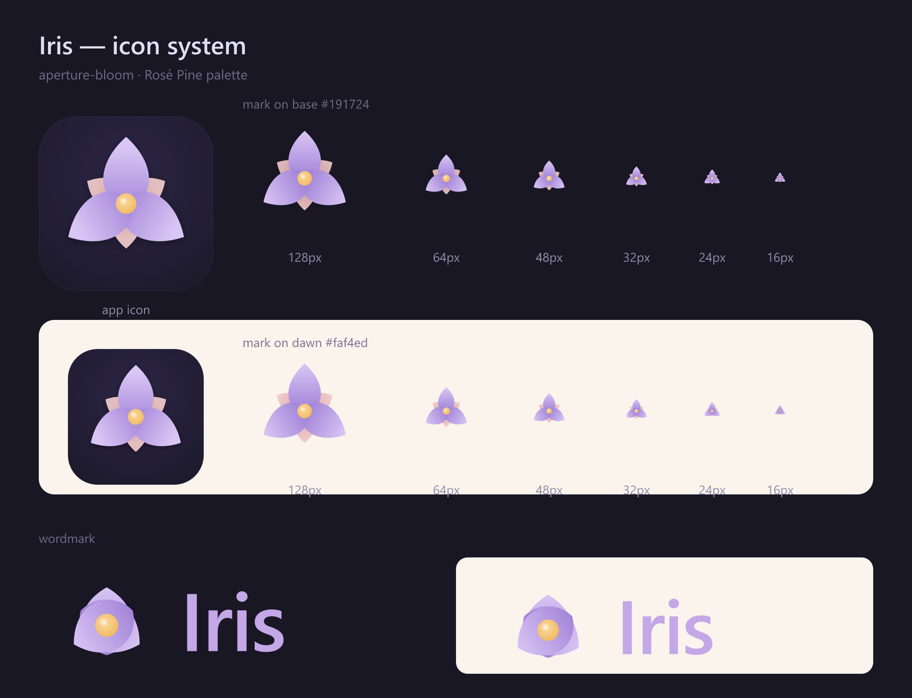
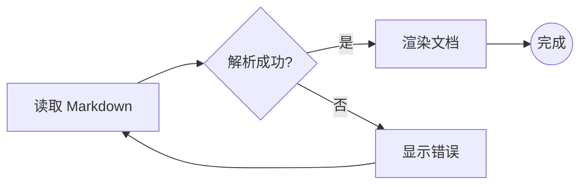
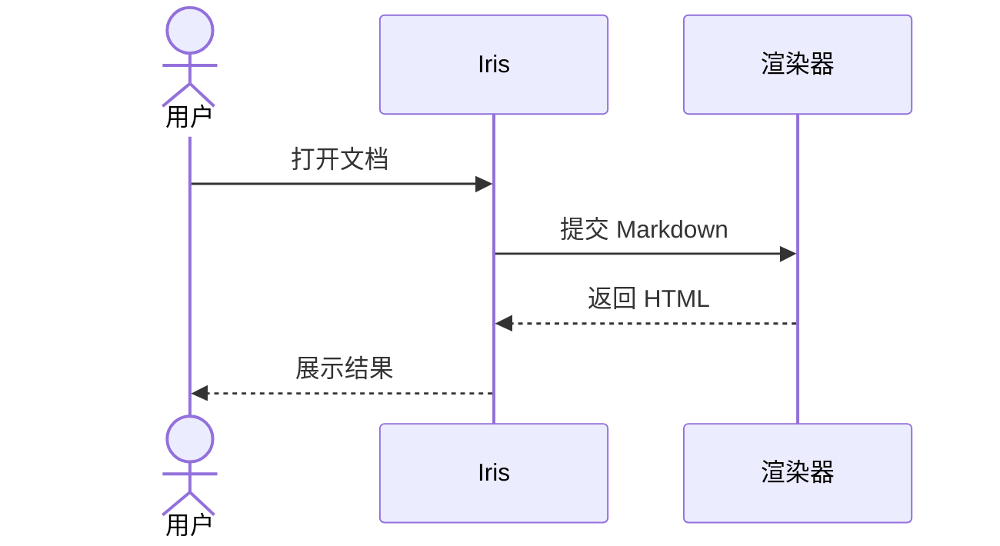
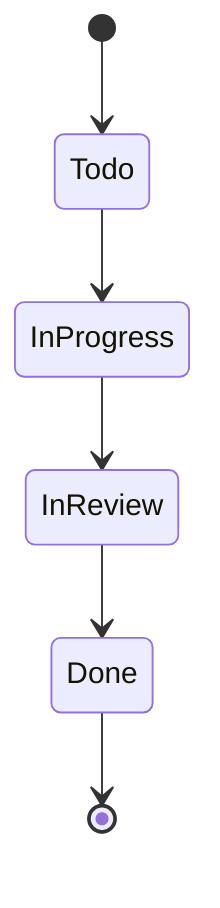
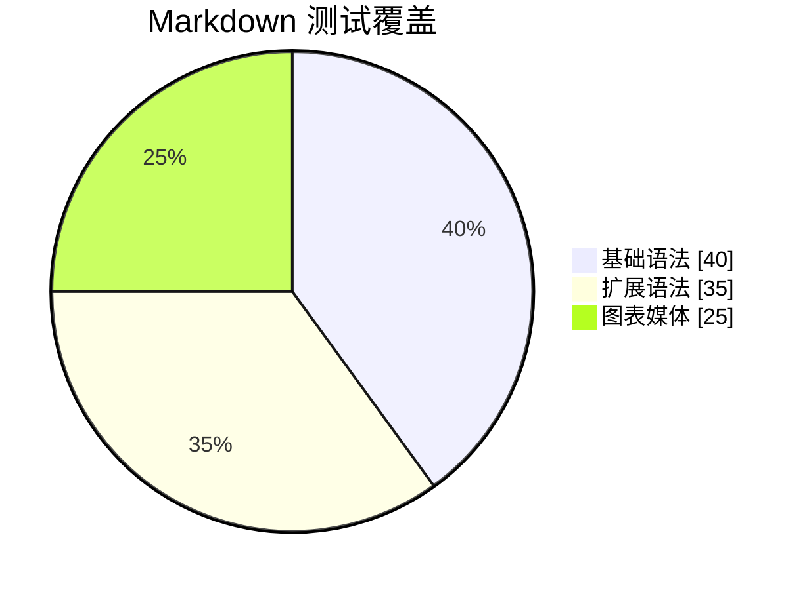

# Markdown 渲染兼容性测试

本文档用于人工检查 Iris 对 CommonMark、GFM 及常见 Markdown 扩展的解析、排版与安全处理。某些扩展可能不受支持；原样显示也属于有效测试结果。

受管图片与附件使用同目录 `<文档名>.assets/` companion 目录和标准相对链接。Crepe 的
粘贴、拖入和上传先经主进程按内容 hash 落盘，成功后才插入链接；本地读取限制在项目
真实路径内并拒绝 SVG、符号链接和超过 10 MiB 的图片。文档头部资产面板按 AST 引用
显示 `referenced`、`orphan`、`missing`、`unmanaged`，支持收编旧相对图片与 data URL，
但不自动下载 HTTPS 或自动清理孤儿。

## 1. 标题与文本

# 一级标题 H1

## 二级标题 H2

### 三级标题 H3

#### 四级标题 H4

##### 五级标题 H5

###### 六级标题 H6

普通段落包含 **粗体**、*斜体*、***粗斜体***、~~删除线~~、`行内代码`、<u>下划线 HTML</u>、H~~2~~O（下标扩展）与 X^2^（上标扩展）。

这是第一行，行末有两个空格。\
这是同一段中的硬换行。

这是下一段，包含中文、English、数字 123、标点符号：，。！？；：“”‘’（）【】以及特殊字符 & < > ©。

反斜杠转义：\*不是斜体\*、# 不是标题、\[不是链接]。

连续横线：---、破折号 --、省略号 ...。

## 2. 链接与自动链接

* [普通链接](https://example.com)

* [带标题的链接](https://example.com "Example 标题")

* <https://example.com>

* <test@example.com>

* 裸 URL：<https://example.com/path?q=markdown#anchor>

* [跳转到表格](#7-表格)

* [引用式链接](https://example.com "引用链接标题")

* [空引用式链接](https://example.org)

## 3. 列表

* 无序项目 A

* 无序项目 B

  * 二级项目 B.1

    * 三级项目 B.1.1

* 含多个段落的项目

  这是同一列表项内的第二段。

1. 有序项目一

2. 有序项目二

   1. 嵌套有序项目
   2. 第二个嵌套项目

3. 有序项目三

4. 非 1 起始的有序列表

5. 应继续显示为 6

* [x] 已完成任务

* [ ] 未完成任务

* [x] 大写 X 的已完成任务
  * [ ] 嵌套任务

## 4. 引用

> 一级引用
>
> 引用中的第二段，含 **粗体** 和 `代码`。
>
> > 二级嵌套引用
> >
> > * 引用中的列表
> >
> > * 第二项

## 5. 分隔线

上方内容。

***

三个星号：

***

三个下划线：

***

## 6. 代码

行内代码：`const value = "中文";`。含反引号的代码：`` `inline` ``。

```javascript
const greeting = 'Hello, Iris'
console.log(greeting)
```

```typescript
interface DocumentMeta {
  title: string
  reflects?: string
}

const meta: DocumentMeta = { title: '兼容性测试' }
```

```powershell
$document = Get-Content -Raw '.iris/status/Markdown 渲染兼容性测试.md'
Write-Output $document.Length
```

```json
{
  "name": "iris",
  "enabled": true,
  "features": ["markdown", "mermaid"]
}
```

```diff
- oldValue: false
+ newValue: true
```

```text
无语言高亮的等宽文本
    保留缩进与空格
```

```
这是四空格缩进代码块。
第二行应保持等宽。
```

所见即所得编辑器中的代码块隐藏 CodeMirror gutter（包括行号及其占位），左侧以加粗且与代码正文对齐的独立文字标签显示语言，右侧常显无底板的复制图标；语言选择弹层不受代码块边界裁剪，内容区域保留适中的左右内边距，当前行仅在代码块获得焦点时高亮。

应用级 DropdownMenu 默认使用非模态模式，打开主题、状态、标签、分支等下拉菜单时不会对编辑器施加全局滚动锁，也不会触发可见 CodeMirror 代码块退化为 placeholder 后重建；需要模态交互的调用方仍可显式覆盖。

Iris 在 Crepe 中注册自有的 `code_block` NodeView 工厂来控制代码块虚拟化生命周期。Milkdown 仍负责代码块 UI、语言加载和首次进入视口时的惰性初始化；代码块初始化后由 Iris 禁止离屏 teardown，因此滚出视口超过 5 秒也不会替换为 placeholder。策略只作用于 Iris 创建的 NodeView 实例，不修改 Milkdown 全局 prototype；代码块被删除或文档销毁时仍正常释放资源。运行态验证确认离屏 6.5 秒和打开应用下拉菜单后均保持同一个 CodeMirror DOM 实例。

## 7. 表格

| 左对齐             |   居中   |   右对齐 | 格式内容                      |
| :-------------- | :----: | ----: | ------------------------- |
| Alpha           |  Beta  |   123 | **粗体**                    |
| 中文              |  居中内容  | 45.67 | `code`                    |
| 较长文本用于测试列宽和自动换行 |    C   |    -8 | [链接](https://example.com) |
| 转义竖线            | A \| B |     0 | ~~删除线~~                   |

紧凑表格：

| A | B |
| - | - |
| 1 | 2 |

表格单元格中的长结构：

以下样例用于检查长内容是否导致表格横向撑破、单元格换行异常、格式解析错误或编辑/阅读模式切换跳动：

| 场景 | 长内容 | 观察点 |
| :--- | :--- | :--- |
| 不可断字符串 | `abcdefghijklmnopqrstuvwxyzABCDEFGHIJKLMNOPQRSTUVWXYZ0123456789abcdefghijklmnopqrstuvwxyzABCDEFGHIJKLMNOPQRSTUVWXYZ0123456789` | 长 token 应在单元格内换行或由容器横向滚动，不得撑破页面。 |
| 长中文文本 | 这是一段用于测试表格单元格自动换行的中文文本，内容足够长以覆盖窄屏和宽屏布局，并检查行高是否稳定。 | 中文应按字符换行，不能遮挡相邻列或导致列宽无限增长。 |
| 长链接 | [长路径与查询参数示例](https://example.com/markdown/compatibility/table/cell/with/a/very/long/path?source=iris&mode=compatibility&case=long-structures) | 链接文本应保持可点击，目标地址不应撑宽表格。 |
| 长行内代码 | `const documentMeta = { title: "Markdown 渲染兼容性测试", reflects: "c07af2434e26b5bfb6d5899fa131954062396ade" }` | 等宽文本应保持格式，并在可用宽度不足时稳定降级。 |
| 混合格式与转义 | ***加粗斜体的长文本内容***、~~删除线内容~~、`inline code`、[链接](https://example.com) 与 A \| B | 粗体、删除线、代码、链接和转义竖线应同时正确解析。 |

## 8. 图片

本地 PNG（相对当前文档路径）：



本地 SVG：


指定尺寸的 HTML 图片：


可点击图片：

[](../../build/preview.png)

远程图片：


失效图片（应显示替代文本或破图状态）：


## 9. Mermaid 图表

流程图：



时序图：



状态图：



饼图：



## 10. 数学公式扩展

行内公式：$E = mc^2$，以及 $\sum\_{i=1}^{n} i = \frac{n(n+1)}{2}$。

块级公式：

$$
\int\_{-\infty}^{\infty} e^{-x^2},dx = \sqrt{\pi}
$$

LaTeX 围栏：

```math
\mathbf{A}\vec{x} = \vec{b}
```

## 11. 脚注与定义扩展

这里有一个普通脚注[^1]，还有一个较长的命名脚注[^long-note]。

[^1]: 这是第一条脚注。

[^long-note]: 这是命名脚注的内容。

    缩进段落应继续属于同一个脚注。

术语
: 这是定义列表扩展的定义。

Markdown
: 一种轻量级标记语言。
: 同一术语的第二个定义。

## 12. 提示块扩展

> \[!NOTE]
> 这是 NOTE 提示块。

> \[!TIP]
> 这是 TIP 提示块，包含 **格式文本**。

> \[!WARNING]
> 这是 WARNING 提示块。

::: info
这是容器式提示块扩展。
:::

## 13. HTML 兼容性与安全

<details>
<summary>点击展开 details</summary>

展开后应看到 **Markdown 粗体**（是否解析取决于实现）和 HTML 内容。

</details>

<kbd>Ctrl</kbd> + <kbd>K</kbd>、<mark>高亮文本</mark>、<del>HTML 删除线</del>。

<table>
  <tr><th>HTML 表头</th><th>值</th></tr>
  <tr><td>原生表格</td><td>42</td></tr>
</table>

以下脚本不应执行，文本或标签可能被安全过滤：

```html
<script>alert('Markdown XSS test')</script>

<a href="javascript:alert('XSS')">危险协议链接</a>
```

## 14. Emoji、Unicode 与方向

Emoji：😀 🚀 ✅ ⚠️ ❤️ 👍🏽；短代码扩展：`:smile:` `:rocket:` `:warning:`。

多语言：简体中文、繁體中文、日本語、한국어、العربية、עברית、Русский、Español。

组合字符：café、naïve、Ångström；数学符号：∞ ≠ ≤ ≥ √ π；货币：¥ $ € £。

超长不可分词字符串：`abcdefghijklmnopqrstuvwxyzABCDEFGHIJKLMNOPQRSTUVWXYZ0123456789abcdefghijklmnopqrstuvwxyzABCDEFGHIJKLMNOPQRSTUVWXYZ0123456789`

## 15. 特殊解析边界

URL 与标点：<https://example.com/test。>

邮箱与标点：<test@example.com>。

HTML 实体：& < > " © ☃。

连续空格测试：A     B（普通文本通常折叠空格）。

空代码块：

```
```

嵌套格式：***粗斜体中的*** ***[链接](https://example.com)*** 与 ~~删除线中的~~ ~~`代码`~~。

## 16. 人工验收清单

* [x] 六级标题层级、字号和锚点正确。

* [x] 粗体、斜体、删除线、行内代码与转义字符正确。

* [x] 普通链接、自动链接、引用链接和页内锚点可用。

* [x] 有序、无序、嵌套和任务列表布局正确。

* [x] 引用、嵌套引用和三种分隔线正确。

* [x] 各语言代码块高亮合理且不会横向撑破页面。

* [x] 表格对齐、换行、转义竖线和窄屏滚动正确。

* [ ] 表格单元格中的长文本、不可断字符串、长链接、长行内代码和混合格式不会撑破布局或破坏解析。

* [ ] 本地 PNG、本地 SVG、HTML 图片、图片链接和远程图片正确显示。 无法显示

* [ ] 失效图片能显示合理的替代或错误状态。

* [ ] 受管图片粘贴后关闭并重开仍显示，正文链接为 companion 相对路径且不含 `blob:`。

* [ ] 资产面板能正确显示引用、孤儿、缺失、非受管状态，并完成收编与回收站清理。

* [ ] Mermaid 流程图、时序图、状态图和饼图正确渲染。 无法显示

* [ ] 数学公式能渲染，或以不破坏文档的源码形式降级。 无法显示

* [ ] 脚注和定义列表能渲染，或稳定降级为普通文本。 无法显示

* [ ] GitHub 提示块和容器提示块能渲染，或稳定降级。 无法显示

* [ ] details、kbd、mark 和 HTML 表格按安全策略处理。显示的是纯文本

* [x] 示例中的脚本、事件属性和 javascript 协议不会执行。

* [x] Emoji、多语言、RTL 文字和特殊符号不会乱码。

* [x] 超长字符串、长表格和图片不会破坏页面布局。

* [x] 浅色与深色主题下正文、代码、表格和 Mermaid 均清晰可读。

* [x] 编辑模式与阅读模式的内容一致，切换时无明显跳动。
