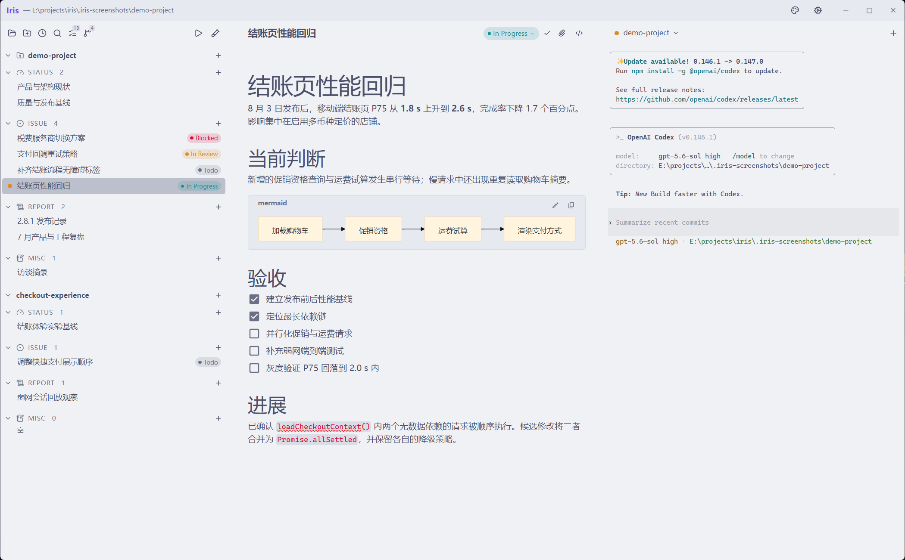
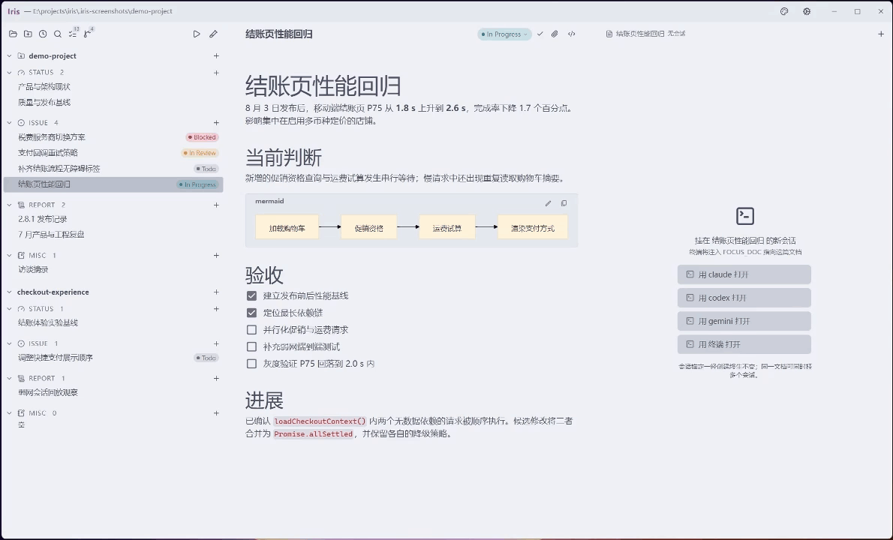
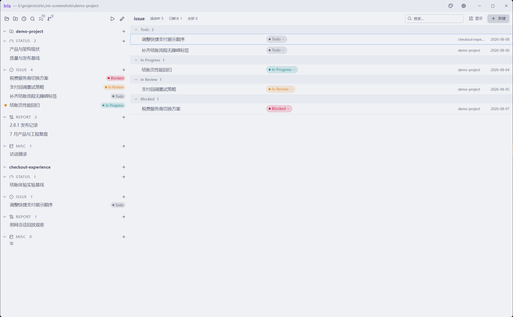

<p align="center">
  
</p>

<p align="center">
  简体中文 · <a href="./README.en.md">English</a>
</p>

<p align="center">
  一个以持久项目记忆为核心的本地优先人机协同开发工作空间。
</p>

Iris 将项目文档、交互式 Agent 终端、Git 状态和人的注意力整合进同一个桌面工作空间。它不内置模型，也不取代你已有的 Agent CLI；它为这些工具提供持久的项目记忆，以及一个让人与 Agent 共同工作的可视化空间。

项目状态以普通 Markdown 文件保存在 `.iris/` 下。Agent 在项目根目录的真实 PTY 中运行，Git 仍然是协作与交付层。Iris 不需要账户、云端数据库、API Key，也不使用专有项目格式。

> 当前版本：`0.1.0-beta.8`。这是现有桌面工作流的稳定化基线。Iris 以 Windows 为优先平台，目前提供 Windows x64 版本。



## 为什么是 Iris

Agentic 开发正在改变瓶颈。代码生产速度越来越快，但代码之外的工作仍然彼此割裂：

- 上下文被反复复制到短暂的聊天和终端会话中。
- 多个并行会话的进展隐藏在不同终端里。
- 等待用户输入的 Agent 和仍在工作的 Agent 看起来没有区别。
- 决策和结果经常停留在对话历史里，没有回到项目中。
- 传统项目管理工具可以描述工作，却无法与本地 Agent 共享真实状态。

Iris 将这些问题视为同一个协调问题：文档是长期记忆，终端会话是工作记忆，文件系统是人、Agent、编辑器和 Git 之间的契约。

## 核心判断

Iris 假设，当 Agent 让代码生产变得更便宜，稀缺资源会转移到其他地方：表达意图、保存约束、跟踪未决问题、评估证据，以及持续修正项目对自身的认识。运行更多 Agent 固然有用，但如果没有人能可靠地找回工作为何存在，也无法判断结果是否正确，那么执行吞吐量就不是最高层的问题。

大多数 Agent 工具把 Agent 或对话当作连续性的主体；Iris 则把项目本身当作连续性的主体。Agent 是可以替换的执行资源，终端会话是可丢弃的上下文。会话可以结束、上下文窗口可以耗尽、Agent CLI 也可以更换，而项目记忆不应随之丢失。任何值得保留的信息，都必须外化为 issue、status、report、任务、代码变更、测试或 Git 历史，而不是困在对话记录中。

因此，Iris 是一个以项目为中心的人机协同开发工作空间。Issue 描述当前现实与目标现实之间的差距；可丢弃的 Agent 会话解释并执行意图；代码和测试提供实现证据；report 保存特定时间点的结论；status 在现实变化后重新陈述当前系统。即使所有参与过工作的 Agent 都已经离开，这个循环仍然可以继续。

```text
意图与约束 -> 可丢弃的 Agent 执行 -> 代码与证据
    ^                                  |
    `-------- 报告与当前项目状态 <------'
```

## Iris 使用 Iris 开发

Iris 完全通过自身工作流进行开发。本仓库的 [`.iris/`](./.iris/) 目录是真实的项目记录，而不是示例：issue 保存意图和调查过程，status 映射当前实现，report 保留有时间属性的结论，任务复选框则让尚待人处理的决策保持可见。

功能和回归问题从 Iris 中的焦点文档开始，由运行在真实 PTY 中、可以互换的 Agent CLI 实现，在代码和测试中验证，并在 Git 固化结果前写回项目记录。持续 dogfooding 是这套设计最主要的证据：项目记忆属于仓库，因此能够跨越单个 Agent 和会话长期存在。

## 核心工作流

1. 在 Iris 中打开一个本地项目。
2. 初始化 Iris 协议，或使用已有的 `.iris/` 目录树。
3. 创建或选择 issue、status、report 或 workspace hub。
4. 从该上下文启动 Claude Code、Codex、Gemini、其他 CLI 或普通 shell。
5. 向 Agent 提出指令。对于支持的 CLI，Iris 已经提供当前文档或工作区上下文。
6. 让 Agent 直接修改磁盘上的代码和 Markdown。
7. Iris 监听文件变化，并重新投影界面状态。
8. 审查结果、更新 issue，并通过 Git 提交。

启动会话并不等于分派后台任务。Agent 会以交互方式启动并等待你的指令。你可以离开当前会话处理其他工作，在会话状态显示可能需要注意时再返回。



## 三层产品结构

Iris 将可移植协议、桌面参考实现和 Agent 适配器分成三个层次。

### `.iris/` 协议

该协议由文件系统约定和 Agent 指引组成。即使不安装 Iris 应用，也可以直接阅读和编辑。

```text
my-project/
|-- AGENTS.md
|-- .iris/
|   |-- status/
|   |   `-- architecture.md
|   |-- issue/
|   |   |-- 2026-08-08-fix-auth.md
|   |   `-- 2026-08-08-fix-auth.assets/
|   |-- report/
|   |   `-- 2026-08-08-auth-review.md
|   |-- misc/
|   `-- spike-new-parser/
|       |-- status/
|       |-- issue/
|       `-- report/
`-- src/
```

`.iris/` 内任何位置出现以下四种目录名时，都具有内置语义：

| 目录 | 时间方向 | 用途 |
| --- | --- | --- |
| `status/` | 现在 | 当前代码库的镜像，并标注其对应的 Git commit |
| `issue/` | 未来与进行中 | 问题、任务、决策及其工作记录 |
| `report/` | 有日期的过去 | 审查、分析、总结和其他阶段性产物 |
| `misc/` | 工作流之外 | 没有新鲜度约束的人类草稿空间 |

距离文档最近的 typed folder 决定文档类型。任何直接包含 typed folder 的目录都会被推断为 workspace，不需要 workspace manifest 或数据库。

Frontmatter key 是按字面解析的接口，值则保持灵活：

```markdown
---
title: Harden session replay
status: In Progress
---
```

Issue 默认状态为 `Todo`、`In Progress`、`In Review`、`Blocked`、`On Hold`、`Done` 或 `Canceled`；report 使用 `Active` 和 `Backlog`。`On Hold` 表示暂时不活跃但尚未解决。Iris 会保留例外状态，而不是拒绝文档。

`labels:` frontmatter 字段已保留但尚未启用。Iris 会保留有效的历史元数据，但应用和托管的 Agent 指引不会创建、编辑、展示、分组或筛选标签。

活跃 issue 中的每一项 GFM task 都会被投影到 Todo 面板：

```markdown
- [ ] 在打包版本中复现问题
- [ ] 使用 Codex 和 Claude Code 验证修复
```

在 Todo 面板中勾选任务，会写回源文档中的对应行。

### 桌面应用

Electron 应用是协议的参考实现和操作控制面，提供：

- 递归扫描 `.iris/` 并实时投影文件系统变化
- 项目初始化和推断式子工作区
- 针对不同文档类型的集合视图
- WYSIWYG Markdown 编辑器和源码模式
- 受管文档资产
- 每个文档或工作区下的多个交互式 PTY 会话
- Git 状态、暂存、取消暂存、提交和本地分支切换
- 会话与 watcher 状态隔离的多项目窗口
- 机器级主题、编辑器行为、终端行为和 Agent 配置

协议保证可移植性，应用则提供工作流效率、安全检查和明确的并发边界。

### Agent 适配器

Iris 运行你已经安装并完成认证的 Agent 命令。默认配置包括 Claude Code、Codex、Gemini 和普通终端，所有条目和命令行都可以编辑。

文档会话会收到：

```text
FOCUS_DOC=.iris/issue/2026-08-08-fix-auth.md
```

Workspace hub 会话会收到 `IRIS_WORKSPACE_PATH`，并且有意不设置焦点文档。

在 Windows 上，Iris 可以安装生成的 SessionStart 上下文脚本 `~/.iris/focus-context.ps1`，并在用户明确确认后连接受支持 CLI 的 hook 配置。当前 hook 适配器识别 Claude Code、Codex CLI、Gemini CLI、Qwen Code 和 Cursor CLI。不支持 hook 的 CLI 仍然可以直接读取环境指针和项目指引。

静态项目规则位于 `AGENTS.md` 等入口文件中，动态焦点则存在于会话环境。两者生命周期不同，因此有意分离。

## 界面

### 左侧：工作与注意力

Lens Tree 按工作区和类型组织文档。活跃的 issue 和 report 保持突出，已解决工作则离开默认视图。会话状态点显示锚定终端正在输出、已经安静并可能等待输入，还是已经退出。

左侧还提供项目切换、最近项目、新窗口、workspace 创建、搜索、排序、Todo 面板和 Git Source Control。

### 中间：文档与集合

单文档视图将结构化 frontmatter 与 Markdown 正文分离。Typed header 负责标题、状态、保存状态和资产；正文使用 Crepe/Milkdown WYSIWYG 编辑器，支持 GFM、LaTeX、语法高亮代码块、Mermaid 预览、图片上传和 CodeMirror 源码模式。

不同文档类型拥有不同的集合视图：

- Issue 支持活跃状态筛选、搜索、工作区筛选、分组、排序和键盘导航。
- Todo 聚合活跃 issue 中尚未勾选的任务。
- Status 比较每个文档的 `reflects` commit 与当前 Git HEAD。
- Report 使用按日期排列的时间线。
- Misc 保持有意简洁。

### 右侧：真实终端

右侧面板是连接到真实本地 PTY 的 xterm.js，而不是聊天记录。一个文档或工作区可以拥有多个会话。终端支持搜索、剪贴板、文件拖放、文档拖放、响应式尺寸和重新挂载时的完整状态重放。

项目和 workspace hub 会让终端占用完整工作区；选择文档后，界面使用可调整大小的编辑器与终端分栏；集合视图则使用完整区域进行管理。



## 文件是契约

Iris 不会通过解析 Agent 的终端文本来判断工作是否完成，而是观察持久状态：

- Agent 的编辑通过文件系统事件到达应用。
- Renderer 重新扫描并投影当前磁盘状态。
- 编辑器写入使用 compare-and-swap baseline，在替换文档内容前检测外部变化。
- 视图切换、Git 操作、项目切换和关闭应用会先经过编辑器 flush 与冲突检查，再离开 dirty draft。这是安全机制，不是崩溃恢复保证；尚存的 beta 边界记录在[密集开发修改审计](./.iris/issue/2026-08-09-%E5%AF%86%E9%9B%86%E5%BC%80%E5%8F%91%E4%BF%AE%E6%94%B9%E5%AE%A1%E8%AE%A1.md)中。
- 项目操作携带 canonical root 和 generation，使旧项目的延迟事件无法影响新项目。
- 离散的应用内 mutation 通过 FrontCPU 指令流水线按资源串行执行。跨窗口写入用户拥有的配置文件仍在继续加固。

这些保护让普通文件能够服务于人机协同工作流，但 Iris 并不宣称为任意并发写者提供通用事务语义。

## 会话是工作记忆

会话在创建时就确定 anchor。一个文档可以拥有多个会话，项目根和嵌套 workspace 也可以拥有没有焦点文档的 hub 会话。Iris 不会持续重定向一个正在运行的 Agent。

主进程持有 PTY 池。一个 headless xterm 镜像持续跟踪完整终端状态，包括 alternate-screen TUI。Renderer 重新挂载终端时，Iris 会序列化状态并恢复实时输出，同时避免在 replay 边界重复写入。

只要所属窗口仍然打开，会话就能跨 renderer reload 和界面切换继续存在。应用退出、窗口关闭或项目被替换后，会话不会持久化。文档是长期记忆，会话是可丢弃的工作记忆。

## 文档资产

一个文档可以拥有同级 companion directory：

```text
2026-08-08-auth-review.md
2026-08-08-auth-review.assets/
```

导入资产使用内容哈希生成稳定、可移植的文件名。Asset 面板根据 Markdown 引用和磁盘内容推导四种健康状态：已引用、孤立、缺失和未管理。它可以收编历史本地图片或 data URL、复制 Markdown 链接、在文件管理器中显示文件，并将未引用的受管资产移入系统回收站。

Iris 不会自动下载远程资产，也不会自动删除 orphan。删除文档时，Markdown 文件和 companion directory 会作为一个整体移入系统回收站。

## Git 集成

内置 Git 视图有意保持精简和本地化：

> [!NOTE]
> `0.1.0-beta.7` 对现有 Git 基础闭环做了集中加固：重命名与复制、同一文件的已暂存/未暂存双层状态、首次提交前仓库、嵌套项目与 linked worktree、提交失败恢复、跨窗口串行化和 watcher reconciliation 均已进入自动化覆盖。Git 视图仍有意只提供本地基础操作，极端规模、跨平台和安装环境矩阵仍在继续验证；关键操作后仍建议用 Git CLI 复核。实现与验收记录见 [Git 基础工作流可靠性缺陷](./.iris/issue/2026-08-09-Git%E5%9F%BA%E7%A1%80%E5%B7%A5%E4%BD%9C%E6%B5%81%E5%8F%AF%E9%9D%A0%E6%80%A7%E7%BC%BA%E9%99%B7.md)。

- 仓库状态和分支信息
- Merge、已暂存、working tree 和未跟踪资源组
- 暂存和取消暂存选中的路径
- 提交已暂存变更
- 切换本地分支
- Git 能够提供时显示 ahead/behind 数量

Iris 当前不提供 diff 编辑、fetch、pull、push、远程账户集成或 merge conflict 编辑器。请继续使用已有 Git 工具完成这些操作。

## 安装

### 系统要求

- Windows 10 或 Windows 11，x64
- 如需使用 Source Control，必须能够从 `PATH` 运行 Git
- 至少安装并认证一个 Agent CLI，也可以只使用普通终端
- 当前 zero-turn SessionStart hook 适配器需要 PowerShell

### 发布版本

预发布版本在 [GitHub Releases](https://github.com/Liyue-Cheng/iris/releases) 页面提供两种形式：

- `Iris-<version>-setup.exe`：每用户安装程序，支持开始菜单和可选桌面快捷方式
- `Iris-<version>-portable.exe`：单文件 portable 版本

Iris 当前没有代码签名。Windows SmartScreen 可能显示“未知发布者”警告。运行前请确认文件来自本仓库的 GitHub Releases 页面。

安装版和 portable 版共享 `~/.iris/` 下的机器级设置。卸载应用不会删除这些设置，也不会删除任何项目中的 `.iris/` 数据。

## 快速开始

1. 启动 Iris，选择 **Open Project Folder**。
2. 如果项目没有 `.iris/`，检查并确认 **Initialize Iris Protocol**。
3. 打开 **Settings > Agents**，配置你使用的 CLI 命令。
4. 可以选择安装 SessionStart hook，以获得 zero-turn 焦点注入。
5. 创建一个 issue，或在 Lens Tree 中选择已有文档。
6. 使用右侧启动器，在该文档上下文中打开 Agent。
7. 给出具体指令，并审查 Agent 在磁盘和 Git 中产生的变更。

初始化会创建四个 typed directory，并在 `AGENTS.md` 中添加或刷新 Iris 拥有的 `<iris-software>` block。`CLAUDE.md` 等已有 vendor entry file 只有在已经存在时才会同步；Iris 不会主动创建一组 vendor 文件。可选的 `<iris-project>` block 可以保存项目级指引，并在已有入口文件之间同步。

## Iris 不做什么

以下是当前产品边界，不是隐藏的路线图承诺：

- 不内置模型、模型 SDK、API Key 或模型订阅
- 不需要账户，不提供云端数据库、托管同步、权限系统或遥测
- 不提供 headless Agent dispatch 或自主编排队列
- 不把 Agent 终端输出解析为业务状态
- 不提供通用源代码编辑器
- 所属窗口关闭后不保留 PTY 会话
- 当前协议不支持自定义文档类型
- 不是完整 Git 客户端
- 尚未提供完整 POSIX 上下文注入适配器

Iris 协调本地工具，而不是取代它们。

## 开发

### 前置条件

- Node.js 22.19 或更高版本（CI 使用 Node.js 24）
- npm
- 能够运行 Electron 和内置 `node-pty` prebuild 的 Windows 构建环境

`front-cpu` 从 npm registry 安装，因此干净 checkout 不需要同级本地仓库。

### 命令

```powershell
npm install
npm run dev
```

质量检查：

```powershell
npm test -- --run
npm run typecheck
npm run build
npm run licenses:check
```

创建 Windows x64 installer 和 portable 产物：

```powershell
npm run dist
```

产物输出到：

```text
dist/release/<version>/
```

如果第三方声明已经过期，`npm run dist` 会拒绝打包。修改依赖后，运行 `npm run licenses:generate` 并审查生成的 diff。

开发版使用独立的应用数据和 Electron single-instance profile，因此可以与安装版同时运行，不共享设置或锁。

## 架构

```text
src/main/       Electron 生命周期、项目扫描、文件 watcher、PTY、
                资产、Git、持久化、提示词治理和 IPC
src/preload/    狭窄且启用 context isolation 的 renderer bridge
src/renderer/   React 界面、投影 store、编辑器、终端视图、
                FrontCPU 指令定义和 interrupt
src/shared/     跨进程模型、IPC channel 名称、Markdown 工具、
                状态定义和终端快捷键
```

主进程是项目 scope、磁盘访问、PTY 生命周期和 Git 操作的权威。Renderer 保存 read-side projection，并通过指令流水线发送 mutation。持续终端 I/O 会绕过该流水线，避免为每次按键支付调度开销。

主要技术包括 Electron、TypeScript、React 18、Tailwind CSS、Radix UI、Milkdown/Crepe、CodeMirror 6、node-pty、xterm.js、chokidar、gray-matter、remark、Mermaid、Vitest 和 FrontCPU。

## 当前状态

Iris 是一个通过自身仓库持续 dogfooding 开发的 beta 软件。`0.1.0-beta.8` 将文件系统协议、项目 scope、文档工作流、终端状态恢复和本地 Git 基础闭环收敛为当前桌面版本的稳定化基线。

从这个版本起，`main` 进入稳定维护阶段，以 bug 修复、可靠性、兼容性和必要的小幅体验改进为主，不再承载大规模产品重构。基于 Pi 或未来其他代码 Agent 运行时（包括可能的 DeepSeek Code 方案）的内置 Agent 探索，将在独立开发分支推进；具体运行时会根据成熟度和可维护性选择。当前 `beta.7` 仍只协调用户已经安装并认证的外部 Agent CLI，不内置模型或 Agent 运行时。

欢迎通过 [GitHub Issues](https://github.com/Liyue-Cheng/iris/issues) 提交 bug 和聚焦的设计讨论。

## 数据与隐私

- 项目产物以普通文件形式保留在项目仓库中。
- 机器设置保存在本地 `~/.iris/` 下，开发版使用 `~/.iris-dev/`。
- Agent 认证和计费仍由各 Agent CLI 管理。
- Iris 不发送遥测。
- 外部链接只有在使用允许的 Web 或邮件协议时才会在系统浏览器中打开。
- 本地文档和资产操作会对 active project boundary 进行路径校验。Symlink 和 junction 加固仍是 beta 限制；不要让 `.iris/` 或 typed folder 通过链接指向项目之外的位置。

请像审查独立终端中的 Agent 变更一样审查 Iris 中的变更。Iris 改善上下文和可见性，但不会对本地 Agent 能够执行的命令提供沙箱。

## 许可证

Iris 使用 [MIT License](LICENSE) 发布。Windows 分发包还包括生成的[第三方软件声明](THIRD_PARTY_NOTICES.txt)、Electron license 和 Chromium notices。
